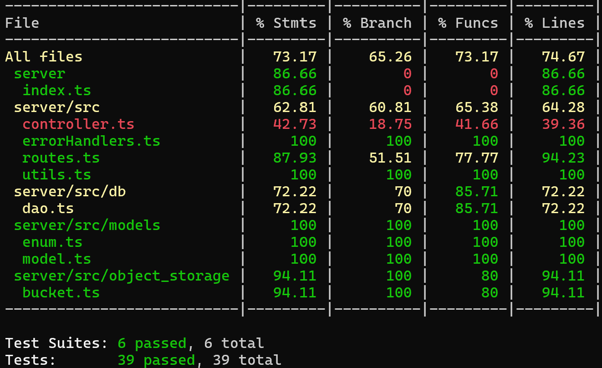

# RETROSPECTIVE (Team 18)

Index:

- [process measures](#process-measures)
- [quality measures](#quality-measures)
- [general assessment](#assessment)

## PROCESS MEASURES

### Macro statistics

**Process Measures**

For this sprint, the team selected **4 stories** to complete, with a total of **21 story points** planned and committed to by the end. The initial estimation made during the planning meeting was **80 hours 15 min**, while the actual time spent was **80 hours and 58 minutes**, completing the sprint slightly above the planned estimate.
  
**Sum-up**

| Metric           | Planned/Committed | Actual/Completed |
| ---------------- | ----------------- | ---------------- |
| **Stories**      | 4                 | 4                |
| **Story Points** | 21                | 21               |
| **Hours**        | 80 hours 15 min   | 80 hours 58 min  |

### Quality Assurance Highlights

- **Unit Tests:** All unit tests are passing, ensuring stable and reliable code at the module level.
- **Code Review:** The code has been rigorously reviewed, ensuring adherence to best practices and improved code quality.
- **Version Control System (VCS):** Code is fully tracked and stored in VCS, ensuring version integrity and traceability.
- **End-to-End Testing:** Comprehensive end-to-end tests have been completed to validate functionality across all components.

### Detailed statistics

| Story                                                          | # Tasks | Points | Hours est. | Hours actual |
| -------------------------------------------------------------- | ------- | ------ | ---------- | ------------ |
| _#0_                                                           | 11      | -      | 34h 15m    | 28h 27m      |
| KX-4 Document visualization on the map                         | 5       | 5      | 12h 00m    | 18h 03m      |
| KX-5 Modify and adjust Georeferencing of a document of the map | 3       | 5      | 7h 30m     | 9h 40m       |
| KX-6 List all documents                                        | 8       | 13     | 6h 00m     | 6h 28m       |
| KX-7 Add more resources for a document                         | 3       | 13     | 18h 30m    | 18h 20m      |

### Key Insights and Areas for Improvement

The team successfully completed all planned stories within scope and maintained a high level of accuracy, completing the project 1% under the original time estimate. This alignment indicates strong time management and effective estimation at the story level.

- **Hours per Task:** Estimated at 2.13 hours per task, with actuals close at 2.38 hours, demonstrating effective forecasting overall.
- **Estimation Accuracy:**
  - **Total Estimation Error Ratio:** 11.4%, indicating minor underestimation at the aggregate level.
  - **Absolute Relative Task Estimation Error:** 29.6%, reflecting some variability at the individual task level. While overall hours aligned closely with estimates, refining task-specific estimates could further enhance predictability.

This project’s high completion accuracy, combined with thorough quality checks, underscores a strong foundation in time management and delivery precision.

- Total estimation error ratio: sum of total hours spent / sum of total hours effort - 1

  $$\frac{\sum_i spent_{task_i}}{\sum_i estimation_{task_i}} - 1$$

- Absolute relative task estimation error: sum( abs( spent-task-i / estimation-task-i - 1))/n

  $$\frac{1}{n}\sum_i^n \left| \frac{spent_{task_i}}{estimation_task_i}-1 \right| $$

  Here’s a table to summarize the **Detailed Statistics**:

| Metric                                      | Estimated   | Actual     |
| ------------------------------------------- | ----------- | ---------- |
| **Hours per Task**                          | 2.13  hours | 2.38 hours |
| **Standard Deviation per Task**             | 0.57 hours  | 1.30 hours |
| **Total Estimation Error Ratio**            | -           | 11.4%      |
| **Absolute Relative Task Estimation Error** | -           | 29.6%      |

## QUALITY MEASURES

- Unit Testing:
  - Total hours estimated: 11 hours
  - Total hours spent: 9 hours
  - Nr of automated unit test cases 39
- E2E testing:
  - Total hours estimated 16 hours
  - Total hours spent 16.2 hours
- Code review
  - Total hours estimated 8 hours
  - Total hours spent 7 hours 50 min

## CODE COVERAGE

## ASSESSMENT

- What caused your errors in estimation (if any)?

  > Different people's ability to complete the same tasks causes us to write down an average estimate that produces errors depending on who takes them.

- What lessons did you learn (both positive and negative) in this sprint?

  > We learned to organize better for the demo presentation.
  > We are a team capable of collaborating even in difficult situations.
  > We could communicate even more.

- Which improvement goals set in the previous retrospective were you able to achieve?
  - [x] Improve task division.
  - [x] Prepare demos more thoroughly.
  - [Partially] Enhance time management, and reassign tasks if necessary.
  - [Partially] Strengthen internal communication.
- Which ones you were not able to achieve? Why?
  - Enhance time management, and reassign tasks if necessary: because our plan did not achieve the same results for everyone.
  - Strengthen internal communication: not everyone is satisfied with the change we experienced.

- Improvement goals for the next sprint and how to achieve them (technical tasks, team coordination, etc.)
  - [ ] Enhance time management, and reassign tasks if necessary.
  - [ ] Strengthen internal communication.

- One thing you are proud of as a Team!!
  > A supportive spirit, along with a strong commitment to doing the project well, is a fantastic quality in the team. It leads to great results and an enjoyable collaboration.
