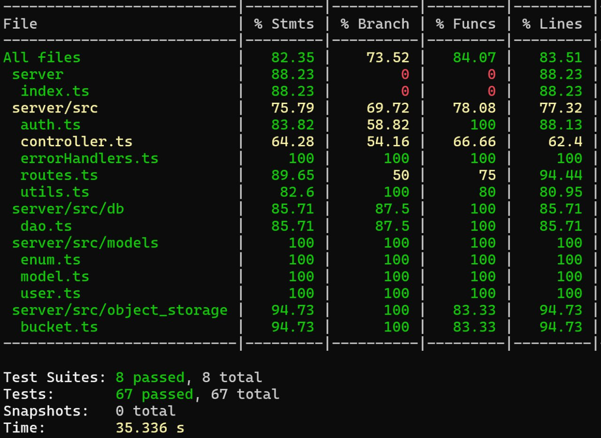

  TEMPLATE FOR RETROSPECTIVE (Team ##)
=====================================

The retrospective should include _at least_ the following
sections:

- [process measures](#process-measures)
- [quality measures](#quality-measures)
- [general assessment](#assessment)

## PROCESS MEASURES 

### Macro statistics

- Number of stories committed vs done 
- Total points committed vs done 
- Nr of hours planned vs spent (as a team)

| Metric           | Planned/Committed       | Actual/Completed        |
| ---------------- | ----------------------- | ----------------------- |
| **Stories**      | 4 (plus technical debt) | 4 (plus technical debt) |
| **Story Points** | 26                      | 26                      |
| **Hours**        | 80 hours                | 80hours 18mins          |

**Remember**  a story is done ONLY if it fits the Definition of Done:
 
- Unit Tests passing
- Code review completed
- Code present on VCS
- End-to-End tests performed

> Please refine your DoD 

### Detailed statistics

| Story | # Tasks | Points | Hours est. | Hours actual |
| ----- | ------- | ------ | ---------- | ------------ |
| _#0_  | 23      | -      | 55h40m     | 54h43m       |
| n  19 | 3       | 5      | 4h         | 4h 55min     |
| n  10 | 6       | 13     | 17h30m     | 18h17m       |
| n  14 | -       | -      | -          | -            |
| n  11 | 1       | 5      | 20m        | 40m          |
| n  20 | 1       | 3      | 2h 30m     | 1h 25m       |
   

> place technical tasks corresponding to story `#0` and leave out story points (not applicable in this case)

- Hours per task average, standard deviation (estimate and actual)

|            | Mean   | StDev |
| ---------- | ------ | ----- |
| Estimation | 1.55h  | 0.69h |
| Actual     | 1.625h | 0.92h |

- Total estimation error ratio: sum of total hours spent / sum of total hours effort - 1

    $$\frac{\sum_i spent_{task_i}}{\sum_i estimation_{task_i}} - 1$$

     0.033 3,30%
    
- Absolute relative task estimation error: sum( abs( spent-task-i / estimation-task-i - 1))/n

    $$\frac{1}{n}\sum_i^n \left| \frac{spent_{task_i}}{estimation_task_i}-1 \right| $$

    0.3038 30.38%
  

  
## QUALITY MEASURES 

- Unit Testing:
  - Total hours estimated  3h
  - Total hours spent      3h 20m
  - Nr of automated unit test cases 67
  - Coverage (see screenshot)
- E2E testing:
  - Total hours estimated 7h
  - Total hours spent     6h 45m 
  - Nr of test cases   (vedere) 
- Code review 
  - Total hours estimated 11h 
  - Total hours spent  7h 35m
- Technical Debt management:
  - Strategy adopted **priority first**
  - Total hours estimated estimated 5h 50m
  - Total hours spent  6h 41m
  

## ASSESSMENT

- What caused your errors in estimation (if any)?

   - Different people's ability to complete the same tasks causes us to write down an average estimate that produces errors depending on who takes them.

    - We underestimated the map-related tasks, as small adjustments required significant effort.

    - We initially overlooked the UI structure, and its refactor presented several challenges that needed to be addressed.

- What lessons did you learn (both positive and negative) in this sprint?
  
   - We have learned, as individuals, how to choose the tasks best suited to our skills and leave others to those who are more capable of handling them, in order to manage our time better.

   - A negative lesson learned during a sprint is not underestimating the technologies, as they can take more time and resources than expected.

- Which improvement goals set in the previous retrospective were you able to achieve? 

    - Enhance time management.
  
- Which ones you were not able to achieve? Why?
    - Strengthen internal communication due to time constraints and the team's focus on task completion, which left little room for dedicated communication improvements.

- Improvement goals for the next sprint and how to achieve them (technical tasks, team coordination, etc.)
  
   - Strengthen internal communication by setting up regular check-ins and using collaborative tools to ensure alignment.
  
   - Manage complex tasks more effectively by breaking them down into smaller, more manageable pieces, starting them earlier, and assigning them to team members based on expertise.

> Propose one or two

- One thing you are proud of as a Team!!
  Despite the friction, we put aside our differing opinions and approaches to focus on delivering good work.